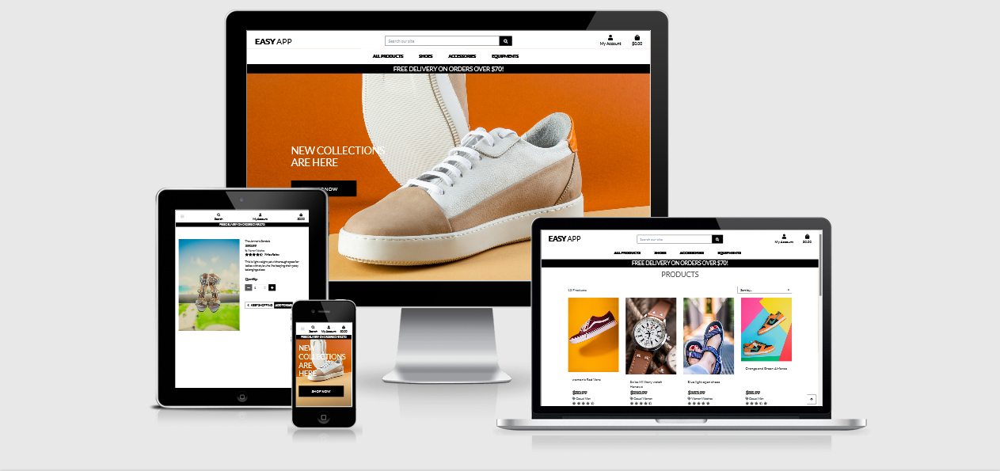
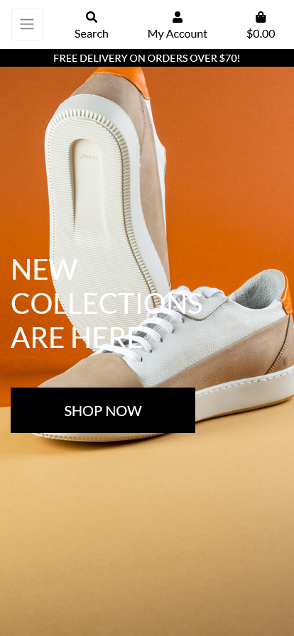

<h1 align="center">Easy App</h1>



View the repository in GitHub [here](https://github.com/Rj12-art/MLS4-easyapp)

View the live project [here](https://mls4.herokuapp.com/)

# Overview

The Easy App is developed as the 4th milestone project as part of Code Institute's Full Stack Software Software Development course. The full stack application uses a Django framework, HTML, CSS, Javascript and Python. 

Easy App is a fictitious online e-commerce retailer providing shoes, accessories and equipment for consumers. Visitors to the site would be able to browse all products available split into several targeted categories highlighted right under the product, register for an account to view past orders, add products to a the bag, write product reviews, contact the company with any queries. 

Easy App features e-commerce functionality, a payments system using Stripe, CRUD functionality for admin users to manage, products, contact messages and Django's integrated admin section for admin users to access database records. 

Please Note that the website is for educational purposes only. Stripe's credit card payment functionality is real but remains in a "test mode" so that no payments will be taken. Please do not enter any personal credit/debit card numbers whilst using the site. 

To use the Stripe payment system when making purchases please use the following details: 
- Card Number: 4242 4242 4242 4242
- Date: Any future date
- CVC: Any number

# Table of Contents

-   [1. UX](#ux)
    -   [1.1. Strategy](#strategy)
        -   [Project Goals](#project-goals)
            -   [User Goals:](#user-goals)
            -   [User Expectations:](#user-expectations)
            -   [Admin Expectations:](#admin-expectations)
            -   [Trends of Modern Websites](#trends-of-modern-websites)
            -   [Strategy Table](#strategy-table)
    -   [1.2. Structure](#structure)
    -   [1.3. Skeleton](#skeleton)
    -   [1.4. Surface](#surface)
-   [2. Features](#features)
-   [3. Technologies Used](#technologies-used)
-   [4. Testing](#testing)
-   [5. Development Cycle](#development-cycle)
-   [6. Deployment](#deployment)
-   [7. End Product](#end-product)
-   [8. Known Bugs](#known-bugs)
-   [9. Credits](#credits)
# 1. UX

[Go to the top](#table-of-contents)

As a basketball player, I have always liked wearing nice shoes and good accessories in hand. I do drive kilometers to big shoe stores to see if I can have a pair that fits me which I find as a waste of time and energy and hence
The simplest way is to have an application to pick and order. The ordering system is best when it's simple to use and asks for the necessary information.

This project will showcase simplicity and ease to order a product, update a the bag where you save your products, delete the saved product, create a personal profile and save personal information regarding the purchase that you may use in future purchses a.
## 1.1. Strategy

[Go to the top](#table-of-contents)

### Project Goals
The main goal of this project is to allow the user to sign up, sign in/out, create/update a user profile and create/update/delete a product on the bag in a simple and effective process.

### User Goals

#### First Time Visitor Goals
1. As a first time user, I would like to instinctively know what the website is offering. 
2. As a first time user, I would like an intuitive navigation system to easily move around the site. 
3. As a first time user, I want to be able to view a range of products on the same page. 
4. As a first time user, I want to be able to view individual product detail. 
5. As a first time user, I want to be able to locate any special offers & deals to take advantage of any reduced prices. 
6. As a first time user, I want to be able to contact the business with any queries I may have. 

#### Registered user Goals
7. As a site user, I want to be able to sign up and register an account to make future purchases easier. 
8. As a site user, I want to be able to have access to a personal profile page where I'm able to see my order history and delivery details. 
9. As a site user, I want to be able to leave reviews on products to inform future site users about the business's products. 
10. As a site user, I want to be able to save items to the bag for ease of purchase on future visits. 

#### Frequent visitor Goals
11. As a site user, I want to be able to see all the products that the company sells. 
12. As a site user, I want to be able to narrow down the products by categories and sub-categories. 
13. As a site user, I want to be able to sort products with various parameters. 
14. As a site user, I want to be able to search for products using keywords. 

### User Expectation:
15. As a purchasing user, I want to be able to select product sizes (on products that have sizes) and select the quantity of product I wish to purchase. 
16. As a purchasing user, I want to be able to add items to a basket should I wish to make more than one purchase. 
17. As a purchasing user, I want to be notified when I've made changes to my basket and show an updated total price. 
18. As a purchasing user, I want to be able to update items in the basket by changing the quantity or removing the item from the basket entirely. 
19. As a purchasing user, I want to be able to checkout securely. 
20. As a purchasing user, I want to be able to view a confirmation page of my order and receive an email confirmation once the purchase is successful. 

#### Admin Expectations:
21. As a site owner, I want to be able to add, edit and remove products from the site easily. 
22. As a site owner, I want access to an admin section to view and manage orders. 
23. As a site owner, I want to be able to delete product reviews if they are unsuitable for the site. 
24. As a site owner, I want to be able to monitor contact messages that have been submitted by site users and delete them once they have been responded to. 


### User Stories
Throughout the project I used the developer tools to verify user stories as my project management tool. This helped me keep focus on the implementaion of the site's responsiveness through all media screen . I would then add, commit and push once it was well responsive.

### Strategy Table
Opportunity/Problem/Feature| Importance| Viability/Feasibility
------------ | -------------------------|---------
Display all products | 5 | 5
Account signup | 5 | 5
User profile | 5 | 5
Responsive design | 5 | 5
Contact form | 4 | 5
Ability to create an order | 5 | 4
Ability to update the product | 5 | 4
Ability to cancel the product | 3 | 4
Ability to add reviews | 5 | 4
Ability to checkout the order | 5 | 5

Total | 47 | 42

## Scope
As I am unable to include all of the features from the strategy table. I will phase this project in multiple phases. Phase 1 will be what I have identified as a minimum viable product. Please find below the plans I have for each phase.

### Phase 1
- Display all products
- Allow users to register for an account
- Allow users to create and edit a personal profile
- Responsive design
- Contact form
- Ability to create  a product
- Ability to update a product
- Ability to delete a product

### Phase 2
- avoid users uploading/adding products
- Avoid users editing a product
- Contact form model, so messages are saved to the database
- Email confirmation when a product is checked out.
- Account email verification

<a name="structure"></a>

## 1.2. Structure

[Go to the top](#table-of-contents)

It is really important to include responsive design in this project as many users are using different devices (mobile, tablet, laptop/PC). This gives the user the best experience on their device.

- Responsive on all device sizes
- Easy navigation through labelled buttons
- Footer at the bottom of the index page that links to the social media website.
- All elements will be consistent including font size, font family, colour scheme.

### Database Model
Planned database structure:


Final database structure:

```  Python
class Product(models.Model):
    category = models.ForeignKey('Category', null=True, blank=True, on_delete=models.SET_NULL)
    sku = models.CharField(max_length=254, null=True, blank=True)
    name = models.CharField(max_length=254)
    description = models.TextField()
    has_sizes = models.BooleanField(default=False, null=True, blank=True)
    price = models.DecimalField(max_digits=6, decimal_places=2)
    rating = models.DecimalField(max_digits=6, decimal_places=2, null=True, blank=True)
    image_url = models.URLField(max_length=1024, null=True, blank=True)
    image = models.ImageField(null=True, blank=True)

    def __str__(self):
        return self.name
        
        
class UserProfile(models.Model):
    
    user = models.OneToOneField(User, on_delete=models.CASCADE)
    default_phone_number = models.CharField(max_length=20, null=True, blank=True)
    default_street_address1 = models.CharField(max_length=80, null=True, blank=True)
    default_street_address2 = models.CharField(max_length=80, null=True, blank=True)
    default_town_or_city = models.CharField(max_length=40, null=True, blank=True)
    default_county = models.CharField(max_length=80, null=True, blank=True)
    default_postcode = models.CharField(max_length=20, null=True, blank=True)
    default_country = CountryField(blank_label='Country', null=True, blank=True)

    def __str__(self):
        return self.user.username
        

```

<a name="skeleton"></a>

## 1.3. Skeleton

[Go to the top](#table-of-contents)

### Wire-frames
The project was prepared with quite alot of the wireframes that were much detailed but below I intended to share some of the many I designed just to showcase how the design skeleton of this project looked like.
On the finished product illustrations, you will find all the clear implemented display of every page of the project in small and large screen device.

Home/Landing Page Desktop:
When the home page is accessed with large device screen:
 

All Products Page Desktop:
When the all products page is accessed by large device screen:


Sign Up /Register Page Desktop:
When a user accesses the register / sign up page on desktop display:


Sign In /Login Page Desktop:
This displays to a registered user trying to access their acoount on desktop:


Product Detail Page Desktop:
When User gets more information on the specific product using a desktop display:


Shopping bag Page Desktop:
When the user wants to know what they have on their bag using a desktop display:


Profile Page Desktop:
When a user trys to view their profile information using desktop screen:


Checkout Page Desktop:
When the user successfully added a product to their bag and would like to continue with the checkout, this is their checkout display on desktop:


Success Page Desktop:
When the user successfully made an order transaction of their product, this is their order confirm page/success display on desktop:


### Wire-frames / Mobile view
Below I have shared some but not all of the wireframes design on the small device/mobile displays:

Sign up / register view on mobile:


Sign in / login view on mobile:


My Profile view on mobile:


My Shopping Bag view on mobile:


Checkout view on mobile:


Order Succes view on mobile:


<a name="surface"></a>

## 1.4. Surface

[Go to the top](#table-of-contents)

### Colours

I used less colours since the appearance of the site didn't require much of colouring.

### Typography

I decided to use Lato as my font of choice for the whole pfoject.

The link to the font can be found [here](https://fonts.google.com/share?selection.family=Lato:wght@300&display=swap).

<a name="features"></a>

### Features

#### All Pages

- Delivery Banner - The delivery banner contains information about free delivery and the free delivery threshold. It is fixed to the bottom of the main navigation menu of the screen to allow for ease of access and improved user navigation. The links take users to different parts of the site which are as follows:
    - Unregistered user: 
        - Login link
        - Register link
    - Registered user: 
        - Bag
        - Profile
        - Log Out
    - Superuser:
        - product Management
        - Bag
        - Profile
        - Log Out

- Navbar Desktop - The main navbar has a logo title of the app on the left, which will take users to the home page. Main site links are aligned to the right of the  title logo. Each of these links will open a dropdown menu once hovered on, they have submenu elements linked to them. This is to help aid with navigation by being brief and precised. The search icon has a text input that allows user to type any search query straight away, and the bag icon will take users to their shopping bag page. 

- Navbar Mobile - The mobile navbar has the same logo title but this time on the top middle of the page, search and basket links. A collapsible side nav can be triggered by a burger menu. Scrollable dropdowns allow for all the categories and subcategories to be selected. Also on smaller devices. The height of the navbar is also reduced on smaller screen sizes to allow for more screen real estate. The navbar also sticks to the top of the screen on all devices to allow for ease of access to navigation. 
 

- Toast Messages - Toast message boxes have been used throughout the site to display feedback to the user when they have made interactions with the site. These messages are colour coded to signify different message types: 
    - Green: Success
    - Yellow: Warning
    - Blue: Informative
    - Red: Errors

#### Home page

- Users are greeted with a full height cover image which has relevance to the purpose of the site. There are 3 links available to the user which will take the users to products pages depending on the category they choose, there is also an added link elements called "All Products" that redirects users to search products by category, price and rating with an added link that redirects user to all products. 
- There are featured cards for the 4 product categories for shoes link . On desktop devices, when a user hovers over the card images, each hovered card will display the linked elements by dropdown. On mobile devices when a user clicks on one of the image cards, the links will show the elements by dropdown.  

#### Products Page

- There is a product counter to display how many products are being displayed depending on filtering criteria. This will also display the search term that a user has entered in the search bar. 
- Sorting dropdown selector allows users to sort the products by various parameters. 
- I have kept the layout of the products page similar to that of the Boutique Ado walkthrough project by displaying 4 products in a row on extra large screens, 3 on large screens, 2 on medium and small devices and 1 on extra small screen sizes. 
- Each product card shows the product image. When this is clicked the user is directed to the product detail page, where they can view further details about the product or add it to their shopping bag. 
- Basic product information is displayed below the product image (product name, price, tag to the category, rating if applicable and the add to bagg link tag). I didn't want to overload the product card with too much detail. The information provided is enough to give the user an overview of the product.
- As the number of products displayed on a page can be plenty some I have added a back to top button which resides in the bottom corner of the screen. I have deliberately made this quite minimalist so the focus is not drawn away from the products. 

#### Product Detail Page

- On larger devices the first row is split into 2 columns:
    - Column 1: In this column there is a clear image of the product which allows user's attention to concentrate on the lively visible features of the product.
    - Column 2: This column has basic product information as well as links to take the users to the reviews section. Admin users are also able to edit and delete products using the icons featured in this columns. This column will display below column 2 (product image) on smaller devices.  This section is also for purchasing. The user is able to select the quantity of the product they wish to purchase and select sizes (if the product has sizes). Products can be added to the bag by clicking the add to bag button. Users can return to an all products view by clicking the "Keep Shopping" button. Users are able to add and remove products to and from their bag by clicking the add to /remove from bag button. Users can also pick a relevant size of the product. This section will display below section 2 (product image) on smaller devices.  
    - A reviews tab allows logged in users to submit reviews, and view any reviews that have been made by other users. 

#### Shopping Bag Page

- The shopping bag page can be broken into 5 parts for each product added to their bag: 
    - Product - which displays an image of the product the user has added to their bag. 
    - Product info - displays the name of the product, product sku and the product size (if applicable).
    - Price - displays the individual product price. 
    - Quantity - Users are able to update their order using the quantity selectors and the update button. Users can also remove that product from their shopping bag entirely by clicking the remove button. 
    - Subtotal - displays the subtotal for each product (product price * quantity).
- Underneath the products that are in the user's bag, there is information for bag total, delivery and grand total. If a user does not meet the free delivery threshold a helpful message will be displayed to let them know what they need to spend in order to qualify for free delivery. 
- There is a button to take the users back to the all product page, and a "Secure Checkout" button to take the user to the checkout page. 
- If the user has no items in the shopping bag, a message is displayed to the user to let them know this and a button to take the user to the all products page is displayed. 

#### Checkout Page

- The Checkout page is split into two columns on larger devices, and 2 rows on smaller devices:
    - Order Summary - Gives a nice overview of each of the products that they are purchasing. Images are links that will take the user back to the product details page for that product. Users can also see a breakdown of the order total, delivery and grand total. 
    - Checkout Form - split into 3 sections:
        - Details - where users are invited to fill out their full name and email address. Email address will be auto populated if a user has logged in and saved this information to their profile. 
        - Delivery - Users can fill in where they wish their products to be delivered to. These fields will be auto populated if a user has logged in and saved this information to their profile. 
        - Payment - Users can enter their card details here in order to make payments and purchase their chosen products. 
- Below the checkout form, users can click the "Adjust Bag" button to make adjustments to their shopping bag, or click the "Complete Order" button to make their purchases. Users are informed exactly how much they will be charged with a helpful message directly underneath the "Complete Order" button. 

#### Checkout Success Page 
- When a user successfully checks out a success toast will be shown to the user with the order number and a confirmation email will be sent to the user with some of the details of their order. 
- The checkout success page itself is split into two sections:
    - Order information which details the order info, delivery details and billing info. 
    - Order Summary - Gives a nice overview of each of the products that they are purchasing. Images are links that will take the user back to the product details page for that product.
- More products link which will take the user back to the all products page encouraging the user to make more purchases. 


#### Contact Us Page
- Users can find different ways to contact the company on the contact page. Details for the company address, telephone, email and opening times can be found here. 
- The next section on this page allows users to contact the company using the form provided. Once the user submits a valid form a success message is displayed to the user to provide feedback and an email confirmation is sent to the user to let them know that we have received their query. 
- Contact messages can be located on the site administration page (for superusers only). 

#### Profile Page 
The user profile page is split into two parts: 
- Firstly users can update their default delivery information by filling in the form and clicking the update information button allowing for easier purchasing at checkout. 
- The second column has information about a user's past orders. Users can click on the order number to take them to the checkout success page. Going to the confirmation page from the user's profile, rather than a keep shopping link there is a link for the user to take them back to their profile. A message to inform the user that this is a past order confirmation is displayed to avoid confusion. 

#### User Bag Page
- This page is accessible to all users. If a user has not added any products to their bag then the user will be informed of this and a link to the all products page will be displayed. 
- When a user has added products to their bag they will be displayed here in the same format as the products page. Users will have all the same functionality as the products page from here. 

### Allauth features
- The sign up, register, password reset, email confirmation pages etc, have all been provided by Django allauth and formatted to suit the needs of the site. 

### Admin Features

- Admin will have access to additional features across the site. Firstly admin members will have an additional link in the my account icon (on larger devices) and (on smaller devices) to take the user to the site admin page. Here the admin user will have access to:
    - Add a product page link - This will take the admin user to the add product page. Here the user can fill in the form to add a product to the site. Once added the admin user will be taken to the product detail page for the product added. 
    - Manage Contact Messages - This will take the admin user to the contact management page. Here admin users will be displayed with all the queries that have been submitted by other users. Admin users can view details of these messages by clicking on the name in the table. On both the contact management page and the contact detail page admin users can delete the messages once they have responded to the user. This will trigger a modal to make sure the user is happy to delete the message. 
- On the product page and product detail page admin users will have access to the edit and delete product links. The edit link will take the user to the edit product form, where they can make changes to a product (i.e put in the clearance category). The delete icon will trigger a modal to make sure the user wishes to delete the product and avoid accidental deletions. 

    

### Features left to implement

- Option for billing details and delivery details to be different. Users may wish to deliver items to a different address than their card is registered at. This could cause some issues with authentication. For the purposes of this site, I'm happy to have this as a known limitation. 
- A welcome or discount offer for new customers, such as 20% off their first order, to encourage more registrations. 
- Social Media signup options. 
- Additional payment options such as Apple Pay or Paypal for ease of purchasing. 

# 3 Technologies Used

## Languages Used

- [HTML](https://en.wikipedia.org/wiki/HTML5)
- [CSS](https://en.wikipedia.org/wiki/Cascading_Style_Sheets) 
- [JavaScript](https://en.wikipedia.org/wiki/JavaScript)
- [Python](https://www.python.org/)

## Libraries & Integrations
- [Django](https://www.djangoproject.com/)
    - This was the primary framework used for the project
- [Django Crispy Forms](https://django-crispy-forms.readthedocs.io/en/latest/)
    - This has been used to render the forms on the site.
- [Django Allauth](https://django-allauth.readthedocs.io/en/latest/index.html)
    - This has been used for user authentication on the site.
- [Django Countries](https://pypi.org/project/django-countries/)
    - Used to populate the countries select field on the order form and profile form
- [Coverage](https://pypi.org/project/coverage/)
    - Used to produce a testing report
- [Stripe](https://stripe.com/gb)
    - This has been used to handle payments.
- [Bootstrap](https://getbootstrap.com/)
    - Used as a framework for styling and to make the site responsive
- [Amazon Web Services](https://aws.amazon.com/)
    - Used to store all static files and images
- [SQLite](https://www.sqlite.org/index.html)
    - Database used in development
- [PostgreSQL](https://www.postgresql.org/)
    - Database used in production
- [Heroku](https://id.heroku.com/login)
    - Online Cloud Platform used to deploy the live site
- [Gunicorn](https://gunicorn.org/)
    - Used for deploying the project to Heroku
- [Fontawesome](https://fontawesome.com/)
    - Fontawesome has been used for icons across the website. 
- [Google Fonts](https://fonts.google.com/)
    - Google Fonts feature family "Lato" has been used across the website. 
- [Pexels](https://pexels.com/)
    - Pexels was used to obtain some of the image products.
- [Pixabay](https://pixabay.com/)
    - Pixabay was also used to obtain some of the image products.  
- [jQuery](https://jquery.com/)
    - Has been used to ease DOM manipulation. 
- [Balsamiq](https://balsamiq.com/)
    - This has been used to create the wireframes for the project. 
- [Github](https://github.com/)
    - GitHub is used to store the project code after being pushed from Git.
- [Git](https://git-scm.com/) 
    - Git was used for version control by utilizing the Gitpod terminal to commit to Git and Push to GitHub.

# 4. Testing

[Go to the top](#table-of-contents)

### Google Developer Tools
For every element that I added to my HTML, I would add the basic CSS to my stylesheet. I would then use the inspect element to try different styles. Once I've got it to my liking I would try to see if I can implement the styling with bootstrap, if I could not replicate the styling I would copy the CSS from google and paste it into my CSS stylesheet. This allows me to keep track of the code I am using.

I also checked the accessibility of the page using lighthouse.


### Responsive Tools
I used [Am I Responsive](http://ami.responsivedesign.is) to make sure that all my pages are responsive to all devices.

### W3C Validator Tools
#### HTML:
I used [W3C Markup](https://validator.w3.org/#validate_by_input+with_options) to check for any errors within the HTML pages.

I had an error on the base.html template:


This was then rectified by adding the lang attribute to the current HTML tag and deleting the other one.


I had an error on the contact.html template:


This was then rectified by removing the width styling of 100% and replacing it with a class="w-100".


#### CSS:
I used [W3C CSS Validation](https://jigsaw.w3.org/css-validator/) to check for any errors within my CSS stylesheet.

I had no errors in my CSS file:


### JavaScript:
I used [JS Hint](https://jshint.com/) to check for any errors within my JavaScript script tags. JS Hint showed warnings on line 1 which was missing a semicolon, however as this was for the script tag I have ignored it. This piece of JavaScript was along copied and pasted from an external source therefore, I have not made any changes to the code.

I had no errors in my JavaScript files:


### Python:
I used [PEP8 online](http://pep8online.com/) to check for any errors within my Python files. The validator showed multiple "line too long" errors. This was rectified by adding each statement as a new line.

urls.py errors:


Fixed urls.py validation:


There were also "line too long" errors within my settings.py file but I have chosen to ignore these as this is a very important file.

settings.py errors:


## Manual Testing
I have tested my site on Safari and google chrome on multiple devices.

These include:
-   iPhone X
-   iPhone XS Max
-   iPad Pro
-   MacBook Pro

Please find below my testing process for all pages via mobile and web:

### Navigation Bar

All Pages:
TEST            | OUTCOME                          | PASS / FAIL  
--------------- | -------------------------------- | ---------------
Home page | When clicking the "home" button in the navigation bar on small devices, the browser redirects me to the home page. While in devices with larg screen will automatically open a home page | PASS
Products page | When clicking the "New collections are here" button on the left center of the home page, the browser redirects me to the products page. | PASS
Contact page | When clicking the "contact" button in the navigation bar, the browser redirects me to the contact page. The is active styling will appear as the contact button has a red background. | PASS
product's detail page | When clicking on any product in the product's page, the browser redirects me to that product's details. The page will contain price, information, quantity, size of the product and will have buttons that will allow user to add product to bag or go back to the all product's page but it also allows user to access the write reviews page where only registered users are allowed to edit, delete or write reviews while if the user is admin, the admin is allowed access to edit or delete product a specific product.| PASS
Shopping bag page | When clicking the on "Bag" icon in the far right of the home page, the browser redirects me to my shopping bag page. The user will know they are on this page by the heading and how the content is styled giving user full information of what they added to the bag and if there is nothing in the bag, there will be a message alerting user they have nothing in their bag. | PASS
Check out Page | After the product is added to the bag, the user can click on "Secure Checkout" link to be redirected to the checkout page which contains the 'Details', 'Delivery' and 'Payments' field inputs for the user to fill out to complete their order. The page contains also the order summary detailed in a way the user will be able to certify their product. The page contains buttons that allows user to adjust their bag or place an order by clicking the "Complete Order" button to order the product. | PASS
Thank You Page | This page is accessed after the order has been completed successfully with a message alerting user the email being sent to them to confirm their order, the page also contains vital information inserted by user during their product check out. | PASS
Profile page | This page is accessed by the registered and logged in users. On the home page close to the bag icon, there is a man icon labelled "My Account"  that links to a logout and profile page if the user is not an admin of the site while if the user is admin, the user will have an added link named "Product Management". The "Profile page contains user's order history and personal information saved by default. | PASS
Produc Management | This page is accessed by only the admin of the site and this is located on the like labelled "My Account" on the home page. Admin has the ability to upload new products. | PASS
Register page | When clicking the "My account" icon in the hompage close to the bag icon, link opens a dropdown menu with links to register if not user and login if registered user. By clicking the register link the browser redirects me to the register page. The user will know they are on this page by the information required by site to user to provide. | PASS
Logout page | When clicking the "My account" icon, the link opens a dropdown menu with a link "Logout" if the user is logned in and  the browser redirects me to a confirmation page if I'm certain of my choice. The user will know they are on this page by the heading. | PASS
Text | Checked that all fonts and colours used are consistent. | PASS

### Footer
TEST            | OUTCOME                          | PASS / FAIL  
--------------- | -------------------------------- | ---------------
Facebook | When clicking the Facebook icon, a new tab opens and redirects to the Facebook website. | PASS
Twitter | When clicking the Twitter icon, a new tab opens and redirects to the Twitter website. | PASS
Instagram | When clicking the Instagram icon, a new tab opens and redirects to the Instagram website. | PASS

### Home page
TEST            | OUTCOME                          | PASS / FAIL  
--------------- | -------------------------------- | ---------------
Media | All media assets are displayed properly, have no pixelation or stretched images and is responsive on all devices. | PASS
Responsiveness | Check every element on the page for consistent scalability in mobile, tablet and desktop view.| PASS
Accessibility | Checked the accessibility of the page using lighthouse| PASS


### All Products page
TEST            | OUTCOME                          | PASS / FAIL  
--------------- | -------------------------------- | ---------------
Media | All media assets are displayed properly, have no pixelation or stretched images and is responsive on all devices. | PASS
Responsiveness | Check every element on-page for consistent scalability in mobile, tablet and desktop view.| PASS
Shop Now button | When clicking the shop now button on the page, the browser redirects to all product's page. | PASS
Accessibility | Checked the accessibility of the page using lighthouse| PASS


### Contact page
TEST            | OUTCOME                          | PASS / FAIL  
--------------- | -------------------------------- | ---------------
Media | All media assets are displayed properly, have no pixelation or stretched images and is responsive on all devices. | PASS
Responsiveness | Check every element on-page for consistent scalability in mobile, tablet and desktop view.| PASS
Book now button | When clicking the book now button on the page, the browser redirects to the booking page. | PASS
Accessibility | Checked the accessibility of the page using lighthouse| PASS
Contact Form | Checked the form submits only when all fields are filled out. | PASS


### Product Detail's page
TEST            | OUTCOME                          | PASS / FAIL  
--------------- | -------------------------------- | ---------------
Media | All media assets are displayed properly, have no pixelation or stretched images and is responsive on all devices. | PASS
Responsiveness | Check every element on-page for consistent scalability in mobile, tablet and desktop view.| PASS
Add to Bag button | When clicking the add to bag button on the page, the product is added to the bag automatically. | PASS
Keep Shopping button | When clicking the keep shopping button on the page, the browser redirects me back to all products page. | PASS
Accessibility | Checked the accessibility of the page using lighthouse| PASS
Checkout Form | Checked the form submits only when all required fields are filled out. | PASS
If not signed in | Checked to see if the user has not signed in the site and alloewd a message displays asking the user to create an account or login to save this information . | PASS


### Edit Profile page
TEST            | OUTCOME                          | PASS / FAIL  
--------------- | -------------------------------- | ---------------
Media | All media assets are displayed properly, have no pixelation or stretched images and is responsive on all devices. | PASS
Responsiveness | Check every element on-page for consistent scalability in mobile, tablet and desktop view.| PASS
Accessibility | Checked the accessibility of the page using lighthouse| PASS
Edit Product Form | Checked the form submits only when all required fields are filled out. | PASS
Form validation | Checked that the price field input only allows number input and not any text | PASS


### Product Management page
TEST            | OUTCOME                          | PASS / FAIL  
--------------- | -------------------------------- | ---------------
Media | All media assets are displayed properly, have no pixelation or stretched images and is responsive on all devices. | PASS
Responsiveness | Check every element on-page for consistent scalability in mobile, tablet and desktop view.| PASS
Accessibility | Checked the accessibility of the page using lighthouse| PASS
Add Product button | Checked that the button redirects to the all products page with the product added. | PASS
Cancel  button | Checked that the button redirects to the all products page with no new product added. | PASS


### Create profile page
TEST            | OUTCOME                          | PASS / FAIL  
--------------- | -------------------------------- | ---------------
Media | All media assets are displayed properly, have no pixelation or stretched images and is responsive on all devices. | PASS
Responsiveness | Check every element on-page for consistent scalability in mobile, tablet and desktop view.| PASS
Accessibility | Checked the accessibility of the page using lighthouse| PASS
Create profile form | Checked the form submits only when all required fields are filled out. | PASS
If the profile has not been created | Checked to see if the user has created a profile, if not it will redirect the user to the create profile page | PASS
Form validation | Checked that the telephone number input only allows number input and not any text | PASS


### Edit profile page
TEST            | OUTCOME                          | PASS / FAIL  
--------------- | -------------------------------- | ---------------
Media | All media assets are displayed properly, have no pixelation or stretched images and is responsive on all devices. | PASS
Responsiveness | Check every element on-page for consistent scalability in mobile, tablet and desktop view.| PASS
Accessibility | Checked the accessibility of the page using lighthouse| PASS
Edit profile form | Checked the form submits only when all required fields are filled out. | PASS
Form validation | Checked that the telephone number input only allows number input and not any text | PASS
If the profile has not been created | Checked to see if the user has created a profile, if not it will redirect the user to the create profile page | PASS


### Register page
TEST            | OUTCOME                          | PASS / FAIL  
--------------- | -------------------------------- | ---------------
Media | All media assets are displayed properly, have no pixelation or stretched images and is responsive on all devices. | PASS
Responsiveness | Check every element on-page for consistent scalability in mobile, tablet and desktop view.| PASS
Accessibility | Checked the accessibility of the page using lighthouse| PASS
Register form | Checked the form submits only when all required fields are filled out. | PASS
Sign in link | Checked the sign-in link redirects to the sign-in page with a message sent to email for login confirmation. | PASS


### Sign in page
TEST            | OUTCOME                          | PASS / FAIL  
--------------- | -------------------------------- | ---------------
Media | All media assets are displayed properly, have no pixelation or stretched images and is responsive on all devices. | PASS
Responsiveness | Check every element on-page for consistent scalability in mobile, tablet and desktop view.| PASS
Accessibility | Checked the accessibility of the page using lighthouse| PASS
Sign in form | Checked the form submits only when all required fields are filled out. | PASS
Signup link | Checked the signup link redirects to the home page with message alerting user of being signed in succesfully page. | PASS


<a name="development-cycle"></a>

# 5. Development Cycle

[Go to the top](#table-of-contents)

## Project Checklist
- Install Django and the supporting libraries
    -  Install Django and Gunicorn. Gunicorn is the server I am using to run Django on Heroku.
    - Install support libraries including psycopg2, this is used to connect the PostgreSQL database
    - Install Cloudinary libraries, this is a host provider service that stores images
    - Create the requirements.txt file. This includes the project's dependencies allowing us to run the project in Heroku.

- Create a new, blank Django Project
    - Create a new project
    - Create the app
    - Add Products to the installed apps in settings.py
    - Migrate all new changes to the database
    - Run the server to test

- Setup project to use Cloudinary and PostgreSQL
    - Create new Heroku app
        - Sign into Heroku
        - Select New
        - Select create new app
        - Enter a relevant app name
        - Select appropriate region
        - Select the create app button

    - Attach PostgreSQL database
        - In Heroku go to resources
        - Search for Postgres in the add-ons box
        - Select Heroku Postgres
        - Submit order form

    - Prepare the environment and settings.py file
        - Create env.py file
        - Add DATABASE_URL with the Postgres URL from Heroku
        - Add SECRET_KEY with a randomly generated key
        - Add SECRET_KEY and generated key to the config vars in Heroku
        - Add if statement to settings.py to prevent the production server from erroring
        - Replace insecure key with the environment variable for the SECRET_KEY
        - Add Heroku database as the back end
        - Migrate changes to new database

    - Get static media files stored on Cloudinary
        - Create a Cloudinary account
        - From the dashboard, copy the API Environment variable
        - In the settings.py file create a new environment variable for CLOUDINARY_URL
        - Add the CLOUDINARY_URL variable to Heroku
        - Add a temporary config var for DISABLE_COLLECTSTATIC
        - In settings.py add Cloudinary as an installed app
        - Add static and media file variables
        - Add templates directory
        - Change DIR's key to point to TEMPALTES_DIR
        - Add Heroku hostname to allowed hosts
        - Create directories for media, static and templates in the project workspace
        - Create a Procfile

- Deploy new empty project to Heroku


<a name="deployment"></a>

# 6. Deployment

[Go to the top](#table-of-contents)

I used the terminal to deploy my project locally. To do this I had to:
1. Create a repository on GitHub.
2. Open the terminal within GitPod
3. Enter "python3 manage.py runserver into the terminal.
4. Go to local host address on my web browser.
5. All locally saved changes will show up here.

For the final deployment to Heroku, I had to:
1. Uncomment the PostgreSQL databse from my settings.py file.
2. Set debug = False in my settings.py file.
3. Commit and push all files to GitHub
3. In Heroku, remove the DISABLE_COLLECTSTATIC config var.
4. In the deploy tab, go to the manual deploy sections and click deploy branch.

I had an issue with the deployed site and the CSS was not showing on my screen.
This was rectified by restarting all dynos in Heroku.

<a name="end-product"></a>

# 7. End Product

[Go to the top](#table-of-contents)

Home Page:




Sign Up Page:


Signin Page:


All Products Page:


My profile Page:


Product detail Page:


Shopping Bag Page:


Checkout Page:


Success Page:


Product Management Page:


<a name="known-bugs"></a>

# 8. Known Bugs

[Go to the top](#table-of-contents)

- Some items in the navigation bar don't have a is active red background to show the user they are on the selected page.

- Some forms for this project is built by using the django-crispy-forms libraries therefore, some of the fields do not contain all the validation rules as I cannot target the individual inputs. For example on the edit profile form, I have add the validation rule so that the user can only enter a number, however I couldnt not figure out a way to add a min and max length value.

<a name="credits"></a>

# 9. Credits

[Go to the top](#table-of-contents)

### Code
-   The navigation bar came from [Bootstrap](https://getbootstrap.com/docs/5.0/components/navbar).

- The JavaScript code to set the online booking form to default to the current date came from [Stack Overflow](https://stackoverflow.com/questions/6982692/how-to-set-input-type-dates-default-value-to-today).

- The JavaScript code to disable any previous dates on the online booking form came from [Demo2s](https://www.demo2s.com/javascript/javascript-input-date-input-type-date-disable-dates-before-today.html).

### Content
-   The restaurant logo came from [Adobe Creative Cloud Express logo maker](https://www.adobe.com/express/create/logo).

-   The dragon image from the home page came from [PNGItem](https://www.pngitem.com/middle/wRmbRx_red-dragon-png-red-chinese-dragon-png-transparent/).

-   The banner image from the home page came from [PNGItem](https://pngtree.com/freebackground/chinese-food-pasta-simple-white-banner_1059420.html).

-   The Chinese food image on the menu page came from [Google Images](tinyurl.com/68hzut9u).

-   The Chinese food image on the menu page came from [Google Maps](https://www.maps.ie/create-google-map/).

### Project Acknowledgements
- Code Institue Tutor Support - For directing me to the correct solutions for any bugs.

- My Mentor - For his constructive criticism and always pushing me to go further to develop my skills.
